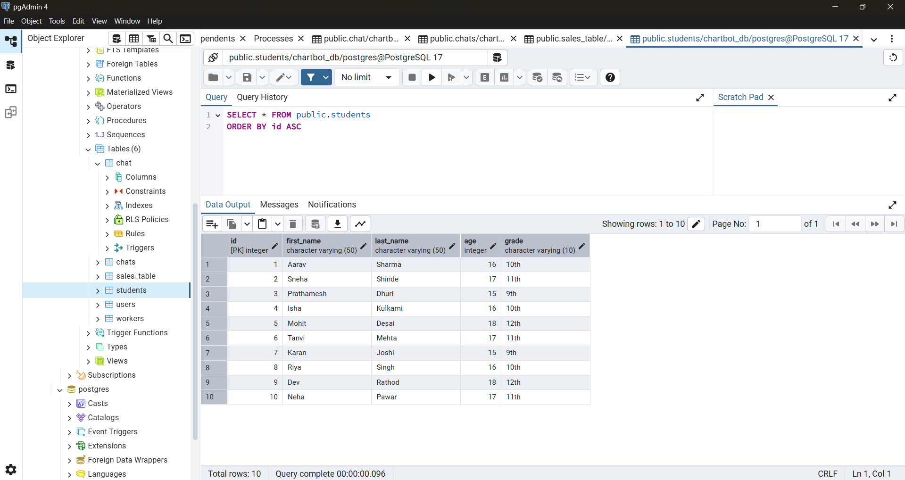

CHAT-DRIVEN CHARTING BOT USING FLASK AND PLOTLY IN WEB APP

Overview:
This project is an AI-driven chatbot integrated with a Flask backend and an HTML, CSS, JS 
frontend. 
It allows users to request data visualizations (like pie charts, bar graphs, etc.) through 
natural language. 
The backend parses the message, maps it to a corresponding Plotly chart template from a 
predefined JSON, and returns the chart, which is rendered on the HTML, CSS, JS web 
interface

New Chat Interface with refreshing previous chat

Query history is saved in frontend also and as well in supabase also

User can export in png,svg and json form 

History is saved in supabase
example: Like,

My database
